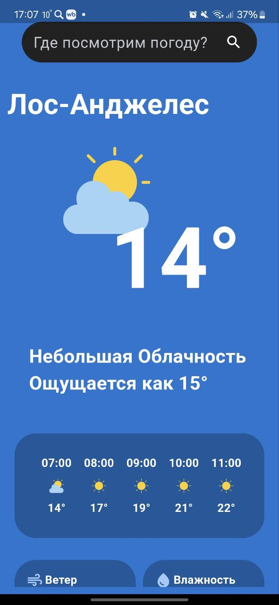
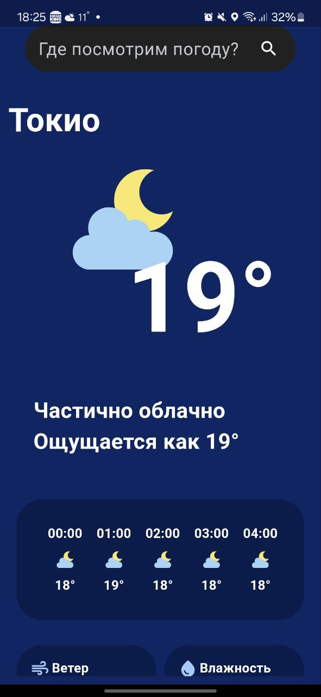
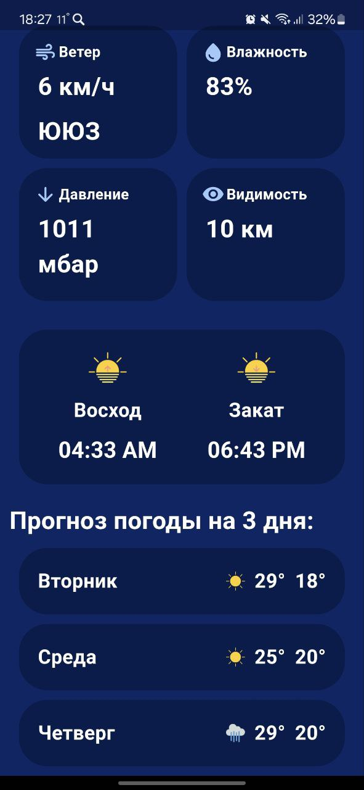
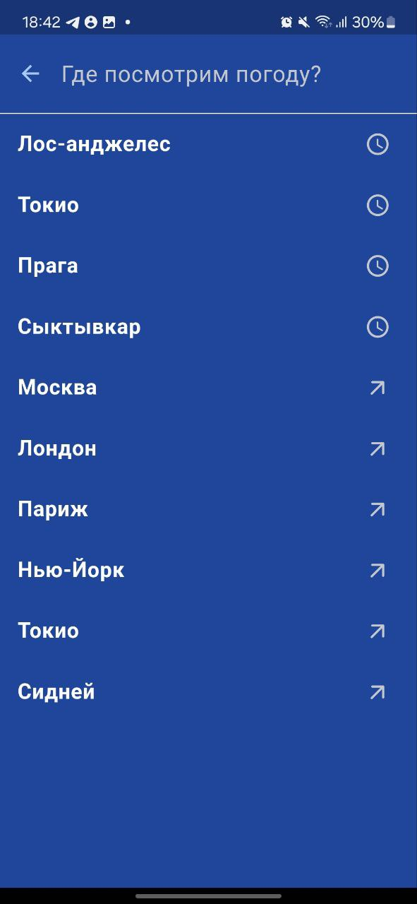

# WeatherCheck
WeatherCheck – это приложение для получения актуальных данных о погоде в выбранном городе, включая температуру, влажность, ветер, облачность и другие важные данные. Наше приложение использует открытый API для получения информации о погоде за окном!

ТЗ: 
 - [ ] Реализация запроса в API для получения текущих данных о погоде в выбранном городе;
 - [ ] Создание базовых элементов интерфейса с использованием flet: главного View, бара для поиска прогнозов погоды по городам, textView для температуры, влажности, скорости и  
 - [ ] направления ветра и других параметров;
 - [ ] Создание и отрисовка иконок для описания текущей погоды;
 - [ ] Реализация поиска городов с отправкой запроса на получение данных;
 - [ ] Сохранение истории поиска;

# Пояснительная записка:

Автор проекта: Савельев Артем Викторович

Описание: Приложение для получения актуальных данных о текущей погоде в выбранном городе, а также почасового прогноза и прогноза на несколько следующих дней. Отображаются такие важные погодные характеристики, как температура, влажность, видимость, давление, описание погоды и соответствующая ей иконка, направление и скорость ветра, температура воздуха по ощущениям, время восхода и заката солнца. Приложение использует открытый API для получения метеорологических данных и ипользует фреймворк flet для интерфейса. 

Реализация: Гланвый запуск работы приложенеия осуществляется через функцию main: в нем происходит отрисовка главной страницы приложения с погодой - Container, в котором находятся бар поиска, температурные характеристики, прогноз погоды, происходит вызов функции для получения актуальных данных о погоде в последнем городе, который смотрел пользователь. 

Вся информация о текущей погоде привязана к классу CurrentWeather. В нем кроме инициализации описан метод get_weather(), который отправляет запрос на получение данных о погоде. В этом методе вызывается метод класса update_screen_info(), в котором происходит обновление всех погодных характеристик. Также в зависимости от дня/ночи меняется цвет фона приложения. Погодные характеристики реализованы через несколько классов: WeatherInfoContainer, HourForecastInfo и DayForecastInfo. 

Первый наследуется от класса Container фреймворка flet: в нем прописаны характеристики, как цвет, размеры, радиус закругления углов, содержимое – надпись и соответствующая иконка. Его содержимое – температура, влажность, давление, видимость.

Все надписи в проекте реализуются через класс StringField, наследующийся от flet.Text класса. В классе описано, как выглядят все надписи в проекте: цвет, стиль, выравнивание, сам текст, размер. 

Еще два класса для погодных характеристик: HourForecastInfo и DayForecastInfo. Объекты первого – контейнеры с температурой, иконкой погоды и временем, который передаются в объект hour_forecast класса flet.Row (ряд объектов с горизонтальной прокруткой) для почасового прогноза погоды на 24 часа вперед. Объекты второго класса – контейнеры с прогнозом погоды на определенный день. Их содержимое – день недели, иконка погоды, температура дня и ночи. Объекты этого класса передаются в day_forecast объект класса Container, где отображаются как колонка.

В проекте есть функция get_weather_icon_ src(). Она в зависимости от описания погоды подбирает и возвращает имя соответствующей иконки, расположенной в assets папке проекта. 

В функции main также описана проверка на первый запуск: если приложение только скачали и начали работу с ним в первый раз: появится приветственный экран с баром поиска, в котором нужно найти город для получения прогноза.

Бар поиска создан через класс WeatherSearchBar, наследующийся от flet.SearchBar. В нем кроме внешнего вида бара описаны методы для получения введенного запроса и отправки соответствующего запроса через API, вызова метода update_screen_info() класса CurrentWeather. История поиска сохраняется и отображается при открытии View у WeatherSearchBar объекта. История сохраняется через flet.page.client_storage и хранится как пара ключ-значение. Поисковые запросы также можно чистить через долгое нажатие, для этого используется del_list_tile метод.

# Используемые технологии:

Фреймворк flet для интерфейса приложения

API с rapidapi.com для получения погодных данных

Библиотека translate для перевода описания погоды на русский язык

Библиотека requests для запросов по API

Библиотека datetime

# Скриншоты приложения

